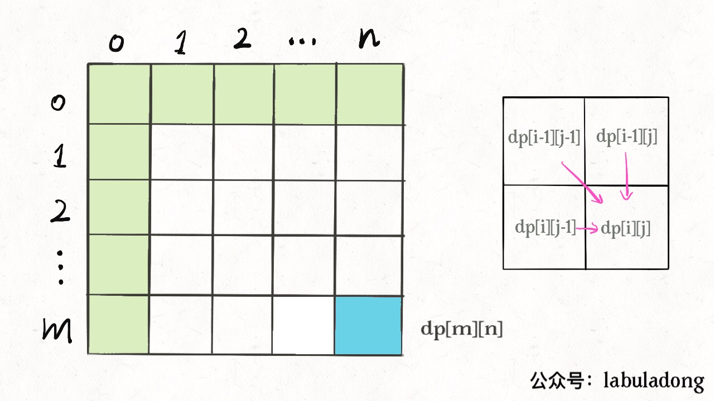
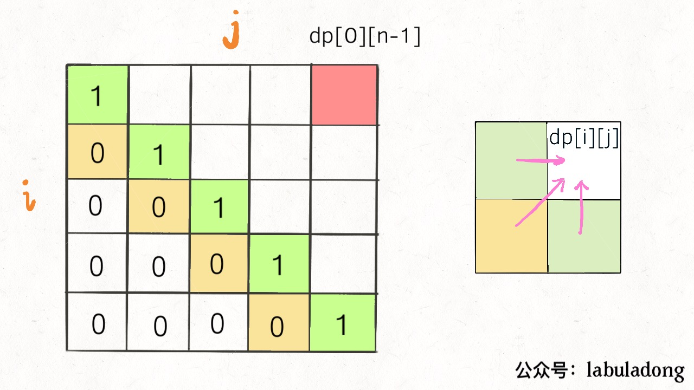

# Q&A on Dynamic Programming

**Translator: [qy-yang](https://github.com/qy-yang)**

**Author: [labuladong](https://github.com/labuladong)**

This article will answer two questions:

1. What exactly is called "optimal substructure" and what is the relationship with dynamic programming?

2. Why does dynamic programming have various ways to traverse `dp` arrays, some are traversing fowards, some are traversing backwards, and some are traversing diagonally.

### 1. Optimal substructure

"Optimal substructure" is a specific property of some problems and is not exclusive to dynamic programming. In other words, many problems actually have optimal substructures, but most of them do not have overlapping subproblems, so we cannot classify them dynamic programming problems.

Let me give an easy-to-understand example: suppose your school has 10 classes, and you have calculated the highest test score for each class. So now I ask you to calculate the highest grade in the school, can you calculate? Of course, and you don't need to re-traverse the scores of every student in the school for comparison, but take the largest of the 10 highest scores to get the highest score of the whole school.

The example is **exhibiting optimal substructure**: the optimal solution of a problem can be derived from the optimal solultion of the subproblem. Calculating the highest score of **each class** is the subproblems. Once you know the answers to all the subprbolems, you can use this to derive the solution of the original problem that calculating the highest score across the school.

You see, such a simple problem has the optimal-substructure property, but since there is no overlapping subproblems, we cannot simply use dynamic programming to find the optimal value.

Another example: Suppose your school has 10 classes, and you know the maximum score difference (the difference between the highest and lowest scores) for each class. And now I ask you to calculate the maximum score difference among the students in the school, can you calculate it? You can figure it out, but you can't calculate it by knowing the maximum score difference of these 10 classes. Because the maximum score difference of the 10 classes does not necessarily contain the maximum score difference of the entire school, for example, the maximum score difference of the whole school may be the difference between the highest score of class 3 and the lowest score of class 6.

The question I asked you this time does **not have optimal sub-structure**, because you cannot get the optimal solution of the entire school through the optimal solution of each class, there is no way to build an optimal solution to the problem from optimal solutions to subproblems. As mentioned earlier in "Detailed Explanation of Dynamic Programming", in order to satisfy the optimal substructure, the subproblems must be independent of each other. The maximum score difference of the whole school may appear between the two classes. Obviously, the subproblems are not independent, so this problem does not have the optimal substructure.

**So what can be done when it lacks of optimal substructure? The strategy is: recontructing the problem**. For the problem of maximum score difference, as we can't use the known score difference of each class, I write a piece of brute-force code like this:

```java
int result = 0;
for (Student a : school) {
    for (Student b : school) {
        if (a is b) continue;
        result = max(result, |a.score - b.score|);
    }
}
return result;
```

Reconstructing the problem or transforming it to an equivalent problem: isn't the maximum score difference equivalent to the difference between the highest score and the lowest score, isn't that the highest and lowest score required, isn't it the first question we discussed, doesn't it exhibit the optimal substructure? Thinking it differently and we can apply the optimal substructure to solve the highest-score & lowest-score problem, and then go back to solve the problem of maximum score difference, isn't it more efficient?

Of course, the example above is very simple, but readers should note that we are constantly seeking the maximum/minimum values when solving the dynamic programming problem. It is essencially the same with the example given. Dynamic programming is nothing more than solving the overlapping subproblems.

Previous sections "different definitions with different solutions" and "throwing eggs in high building throwing (advanced)" showed how to transform the problem. Different optimal substructures may lead to different solutions and efficiency.

Here is another common but very simple example: find the maximum value of a binary tree (for simplicity, assume that all the values in the nodes are non-negative):

```java
int maxVal(TreeNode root) {
    if (root == null)
        return -1;
    int left = maxVal(root.left);
    int right = maxVal(root.right);
    return max(root.val, left, right);
}
```

You can observe that this problem also exhibits optimal substructure. The maximum value of the tree rooted at "root" node can be derived from the maximum value of the subtrees (subproblem) at left and right side. Based on the the example of the school and class before, it should be easy to understand.

Of course, this is not a dynamic programming problem. It is intended to show that the optimal substructure is not a unique property of dynamic programming. Most of the problems with optimal value have this property. **However, the optimal substructure is a necessary condition for dynamic programming problems.** So in the future, if you encounter the problem of optimal value. The dynamic programming is the right idea. This is the trick.

Dynamic programming is to induce the optimal solution starting from simplest base case. It can be viewed as a chain reaction. However, only the problems with optimal substructure have the chain reaction.

The process of finding the optimal substructure is actually the process of verifying the correctness of the state transition equation. There is a brute-force solution if the state transition exhibits the optimal substructure. Next, you can check if there are overlapping subproblems. If so, you can do the optimization. This is also a trick.

We are not giving the examples of non-classical dynamic programming here. Readers can find out how state transition follows the optimal substructure from previous articles. Next, let ’s look at another confusing issue with dynamic programming.

### 2. Traversal order of the `dp` array

I believe that some of the readers will definitely be confused with the traversal order of the `dp` arrays when they do dynamic programming problems . Let's take a two-dimensional `dp` array as an example. Sometimes we traverse forward:

```java
int[][] dp = new int[m][n];
for (int i = 0; i < m; i++)
    for (int j = 0; j < n; j++)
        // Calculate dp[i][j]
```

Sometimes we traverse backward:

```java
for (int i = m - 1; i >= 0; i--)
    for (int j = n - 1; j >= 0; j--)
        // Calculate dp[i][j]
```

Sometimes it may traverse diagonally:

```java
// Traverse the array diagonally
for (int l = 2; l <= n; l++) {
    for (int i = 0; i <= n - l; i++) {
        int j = l + i - 1;
        // Calculate dp[i][j]
    }
}
```

And even more confusing, the correct answer can be obtained by traversing forward or backward sometimes. For example, we can do both the forward and backward in some parts of the problem "best time to buy and sell stock".

If you look it closely, you can find out the reason. There are two points you should take note:

**1. During the traversal, all the required state must have been calculated**.

**2. The final point of the traversal must be the point where the result is stored**.

Let's explain the two principles above in detail.

For example, the classic problem of "edit distance" explained in the previous article [Edit Distance](https://github.com/labuladong/fucking-algorithm/blob/english/dynamic_programming/EditDistance.md). From the definition of `dp`, we know the base case is `dp[..][0]` and `dp[0][..]`. The final answer is `dp[m][n]`; and we know from the state transition equation that `dp[i][j]` is derived from `dp[i-1][j]`, `dp[i] [j-1]`, `dp [i-1] [j-1]`, as shown below:



So, referring to the two principles just mentioned, how would you traverse the `dp` array? It should be a forward traversal:

```java
for (int i = 1; i < m; i++)
    for (int j = 1; j < n; j++)
        // First calculate dp[i-1][j], dp[i][j-1], dp[i-1][j-1]
        // Then calculate dp[i][j]
```

In this way, the left, top, and top left of each iteration will either be base cases or states calculated before, and finally it ends up at the answer we want `dp[m][n]`.

Another example, the palindrome subsequence problem, refer to [Strategies For Subsequence Problem](https://github.com/labuladong/fucking-algorithm/blob/english/dynamic_programming/StrategiesForSubsequenceProblem.md) for details. From the definition of `dp` array, we know the base case is in the middle of diagonal of the array. `dp[i][j]` is derived from `dp[i+1][j]`, `dp[i][j-1]`, and `dp[i+1][j-1]`, and the final answer to be calculated is `dp[0][n-1]`, as shown below:



In this case, there are two correct traversal orders based on the two principles mentioned:


Either traverse obliquely from left to right, or traverse from bottom to top, left to right, so that to ensure the left, bottom, and bottom left of `dp[i][j]` have been calculated.

Now, you should understand these two principles, which is mainly determined by the base case and the location of the final result. You just need to make sure that the intermediate results used in the traversal process have been calculated. Sometimes there are multiple ways to get the correct answer, and you can choose one based on your preference.
