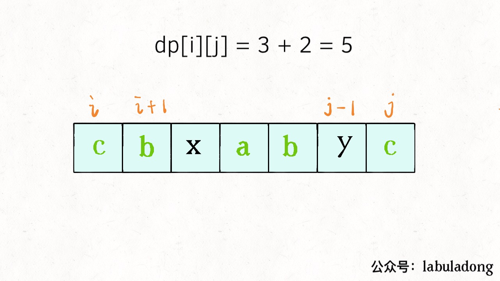
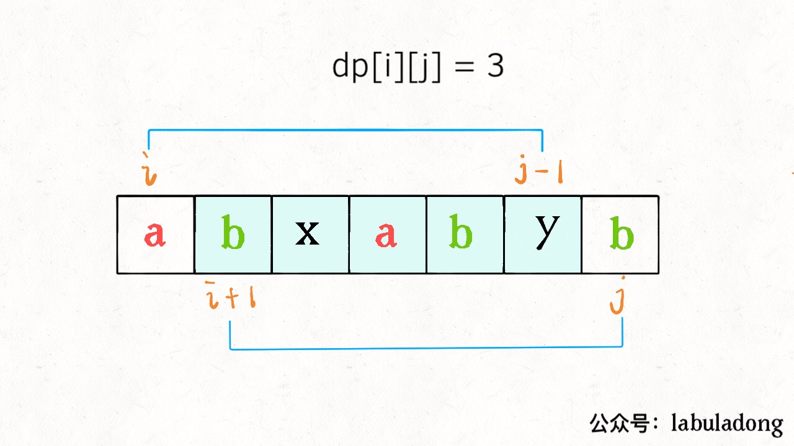

# Problem-Solving Strategies for Subsequence Problem (Dynamic Programming)

**Translator: [sunqiuming526](https://github.com/sunqiuming526)**

**Author: [labuladong](https://github.com/labuladong)**

Subsequence Problem is one of the most common algorithm problem, which is not easy to figure out. 

First of all, the subsequence problem itself is more difficult than those for substring and subarray, since the former needs to deal with discontinuous sequence, while the latter two are continuous. It is hard enough to simply enumerate the subsequences, let alone solve related algorithm problems.

Moreover, the subsequence problem is likely to involve two strings, such as the "Longest Common Subsequence (LCS)" problem in the previous article. Without some processing experience, it is really not easy to figure out. Therefore, this article will come up with a routine for the subsequence related problems. In fact, there are only two types of strategies. As long as these two problem-solving strategies in your mind, it's highly possible to ace the problem.

Generally speaking, this kind of question would ask you to find a **longest subsequence **. Since the shortest subsequence, on the other hand, is just a character, which is not worth asking. Once it comes to subsequences or extreme value problems, it is almost certain that **we need to use dynamic programming techniques, and the time complexity is generally O(n^2)**.

The reason is quite simple. Just think about a string. How many possibilities are there for its subsequence? The answer is at least exponential, right? Thus, we have no reason not to use DP.

Since dynamic programming is used, it is necessary to define the DP array and find the state transition relation. The two strategies we mentioned above are actually the ideas of defining DP arrays. Different problems may require different DP array definitions to solve.

### 1. Two Strategies

**1.1 The first strategy is using a one-dimensional DP array**

```java
int n = array.length;
int[] dp = new int[n];

for (int i = 1; i < n; i++) {
    for (int j = 0; j < i; j++) {
        dp[i] = max|min(dp[i], dp[j] + ...)
    }
}
```

Take an example we used before -- "the Longest Increasing Subsequence (LIS)". The definition of DP array in this case is as below:

**We define `dp[i]` as the length of the required subsequence (the longest increasing subsequence) within the subarray `array [0..i]`**.

Why does the LIS problem require this strategy? The foregoing is clear enough -- because this strategy is in line with the induction method, and the state transition relation can be found. We are not going to discuss this in details further.

**1.2 The second strategy is using a two-dimensional DP array**

```java
int n = arr.length;
int[][] dp = new dp[n][n];

for (int i = 0; i < n; i++) {
    for (int j = 0; j < n; j++) {
        if (arr[i] == arr[j]) 
            dp[i][j] = dp[i][j] + ...
        else
            dp[i][j] = max|min(...)
    }
}
```

This strategy is used relatively more, especially for the subsequences problems involving two strings / arrays, such as the **"Longest Common Subsequence"** we mentioned before. The definition of the DP array in this strategy is further divided into two cases: "Only one string is involved" and "Two strings are involved".

**a) In the case where two strings are involved** (e.g. LCS), the definition of DP array is as follows:

**We define `dp[i][j]` as the length of the required subsequence (longest common subsequence) within the subarray `arr1[0..i]` and the subarray `arr2[0..j]`**.

**b) In the case where only one string is involved** (such as the Longest Palindrome Subsequence (LPS) which will be discussed in this article later), the definition of DP array is as follows:

**We define `dp[i][j]` as the length of the required subsequence (the longest palindrome subsequence) within the subarray `array [i..j]`**.


For the first case, you can refer to these two articles: "Editing distance", "Common Subsequence".

Now let's talk about the Longest Palindrome Subsequence (LPS) problem to explain how to solve DP in the second case in details.

### 2. The Longest Palindrome Subsequence

We have solve the "Longest Palindrome Substring" problem before. This time, the difficulty is increased by finding the length of the Longest Palindrome Subsequence instead of substring:


In this question, **we define `dp[i][j]` as the length of the longest palindrome subsequence within the substring `s[i..j]`**. Please remember this definition so as to understand the algorithm.

Why do we define a two-dimensional DP array like this? We mentioned many times before that **finding state transition relation requires inductive thinking. To put it plainly, it is how we derive unknown parts from known results**, which makes it easy to generalize and discover the state transition relation.

Specifically, if we want to find `dp[i][j]`, suppose you have already got the result of the subproblem `dp[i+1][j-1]` (the length of the longest palindrome subsequence in`s[i+1..j-1]`), can you find a way to calculate the value of` dp[i][j] `(the length of the longest palindrome subsequence in` s[i..j] `) ?


The answer is yes! It depends on the characters of `s[i]` and `s[j]`:

**If they are equal**, then the longest palindrome subsequence in `s[i+1..j-1]` would be these two characters plus the longest palindrome subsequence in `s[i..j]`:




**If they are not equal**, it means that they **cannot appear at the same time** in the longest palindrome subsequence of `s[i..j]`. Therefore, we add them **separately** to `s[i+1..j-1] ` to see which substring produces a longer palindrome subsequence:



The code of the above two cases can be written like this:

```java
if (s[i] == s[j])
    // These two chars must be in the longest palindrome sequence
    dp[i][j] = dp[i + 1][j - 1] + 2;
else
    // Choose the longer palindrome subsequence from s[i+1..j] and s[i..j-1]
    dp[i][j] = max(dp[i + 1][j], dp[i][j - 1]);
```

At this point, the state transition equation is derived. According to the definition of the DP array, what we require is `dp[0][n-1]`, which is the length of the longest palindrome subsequence of the entire `s`.

### 3. Code Implementation

Let's begin with defining the base case. If there is only one character, the longest palindrome subsequence length is 1, which can be represented as `dp[i][j] = 1 (i == j)`.

Since `i`must be less than or equal to `j`, for those locations where `i > j`, there are no subsequences at all and thus should be initialized to 0.

In addition, look at the state transition equation we just got. To find `dp[i][j]`, you need to know `dp[i+1][j-1]`, `dp[i+1][j]` and`dp[i][j -1]` these three values. And look at the base case we determined, this is how the DP array looks like after being filled:


**In order to guarantee that before each calculation of `dp[i][j]`, the values in the left, down and right direction have been calculated, we can only traverse it diagonally or reversely**:

Here I choose to traverse reversely. The code is as follows:

```cpp
int longestPalindromeSubseq(string s) {
    int n = s.size();
    // DP arrays are all initialized to 0
    vector<vector<int>> dp(n, vector<int>(n, 0));
    // base case
    for (int i = 0; i < n; i++)
        dp[i][i] = 1;
    // Reverse traversal to ensure correct state transition
    for (int i = n - 1; i >= 0; i--) {
        for (int j = i + 1; j < n; j++) {
            // State transition equation
            if (s[i] == s[j])
                dp[i][j] = dp[i + 1][j - 1] + 2;
            else
                dp[i][j] = max(dp[i + 1][j], dp[i][j - 1]);
        }
    }
    // return the length of LPS
    return dp[0][n - 1];
}
```

So far, the longest palindrome subsequence problem has been solved.

